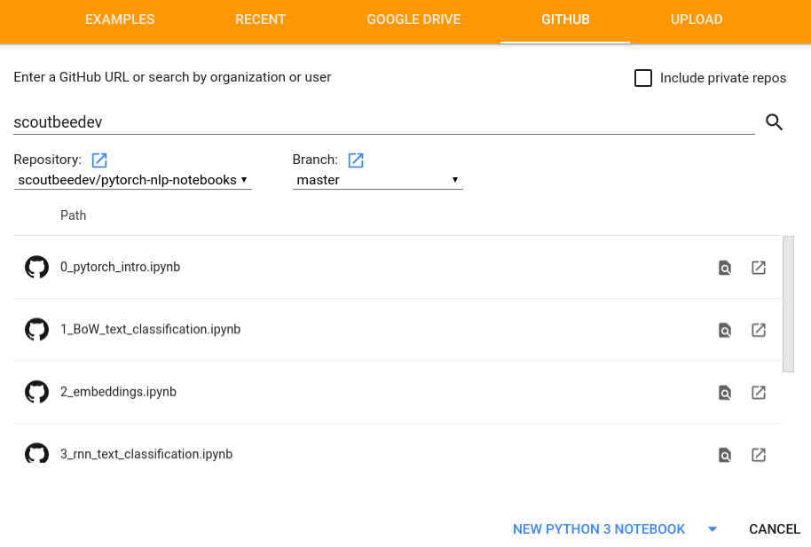

# A Deep Dive into NLP with PyTorch

Learn how to use PyTorch to solve some common NLP problems with deep learning. View these notebooks on [nbviewer](https://nbviewer.jupyter.org/github/scoutbee/pytorch-nlp-notebooks/tree/develop/).

- [`1_BoW_text_classification.ipynb`](https://nbviewer.jupyter.org/github/scoutbee/pytorch-nlp-notebooks/blob/develop/1_BoW_text_classification.ipynb): Train a bag-of-words model to predict the sentiment of IMDB reviews
- [`2_embeddings.ipynb`](https://nbviewer.jupyter.org/github/scoutbee/pytorch-nlp-notebooks/blob/develop/2_embeddings.ipynb): Play around with different pretrained word embeddings
- [`3_rnn_text_classification.ipynb`](https://nbviewer.jupyter.org/github/scoutbee/pytorch-nlp-notebooks/blob/develop/3_rnn_text_classification.ipynb): Train an RNN to predict the sentiment of IMDB movie reviews
- [`4_character_text_generation.ipynb`](https://nbviewer.jupyter.org/github/scoutbee/pytorch-nlp-notebooks/blob/develop/4_character_text_generation.ipynb): Train an RNN to generate weight loss articles
- [`5_seq2seq_attention_translation.ipynb`](https://nbviewer.jupyter.org/github/scoutbee/pytorch-nlp-notebooks/blob/develop/5_seq2seq_attention_translation.ipynb): Train a Seq2Seq model with attention to translate from English to French
- [`6_gpt2_text_generation.ipynb`](https://nbviewer.jupyter.org/github/scoutbee/pytorch-nlp-notebooks/blob/develop/6_gpt2_finetuned_text_generation.ipynb): Fine-tune the pretrained (small) GPT-2 model to generate weight loss articles

View the [slides](https://docs.google.com/presentation/d/1zyuwCx7knqnP-LJswlDfWSmk5FhFgFmYJGqdEZn8yhc/edit?usp=sharing) for the presentation.

## Setup

Make sure you have a Google account and visit [Google Colab](https://colab.research.google.com/github/scoutbee/pytorch-nlp-notebooks). You should see a list of notebooks pop up:



If you have trouble with that, you can also save the notebook you want to run from this repo to your local filesystem, and then upload it to Google Colab with `File -> Open Notebook -> Upload`.

### Basic Navigation

You can run cells with \<SHIFT\> + \<ENTER\>.

### Missing packages

If you find that you are missing a necessary package, you can prepend `!` to a bash command. For example, to install `googledrivedownloader`, you would run in a cell:

```
!pip install googledrivedownloader
```

### Using a GPU

To use a GPU (for free!), select from the top menu from Colab `Runtime -> Change Runtime Type -> Hardware Accelerator -> GPU`. Pay attention to how much memory the GPU is currently using by clicking `Runtime -> Manage Sessions`.

## Contributing

Feel free to submit a PR for cleanups, error-fixing, or adding new (relevant) content!
